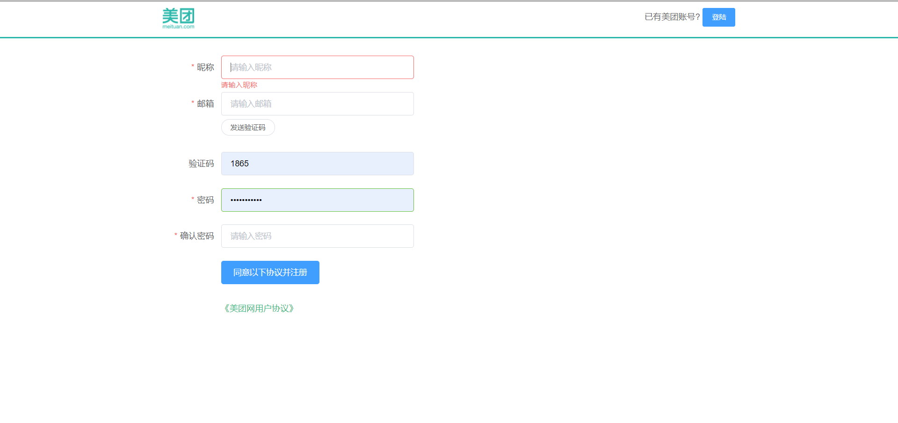
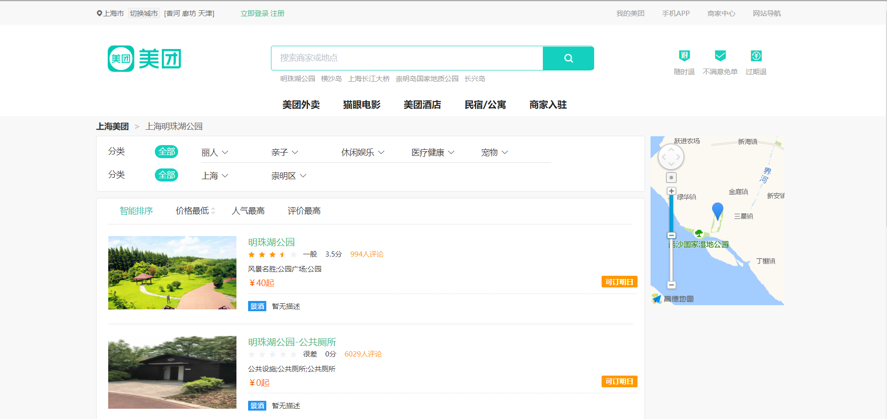
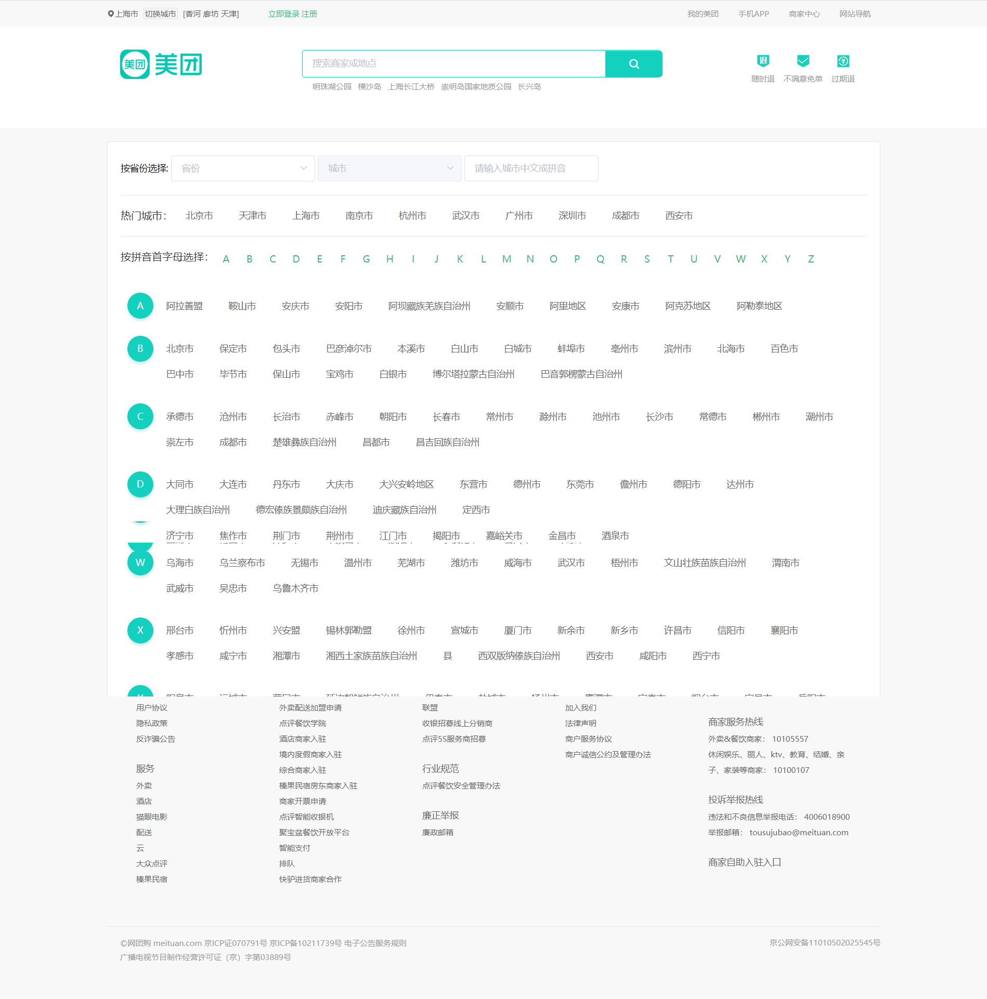

# 项目名称

> Nuxt.js 仿写美图pc端页面


# 个人理解

> 做了一些vue项目自己发现vue真的很好用，轻量快捷，mvvm框架让开发过程中能够专注于开发业务逻辑。同时模块化的组件让日常开发过程中减少了大量的重复工作，但是自己也发现了一些vue的缺点，vue.js是一个单页应用，所有dom组件都会挂载到id为app这个dom节点上，如果不采用按需加载路由的方式，那么就会造成首屏加载缓慢，同时vue对于seo搜素不友好尽管prerender-spa-plugin和vue-meta-info能够做到seo优化但是我还是想寻求另一种方式，vue ssr服务器渲染就解决了这一点。

> 找了一下发现nuxt.js框架，发现是做ssr服务器渲染的，觉得比较好就在慕课学习了下，它的优点在于基于vue.js,无需自己配置路由，生成静态的html文件便于seo搜索引擎的抓取,异步调用接口获取数据（asyncData），首屏加载速度较快。

# 项目说明

> 该项目采用nuxt.js框架，node.js-koa2服务端框架，同时采用本地MongoDB数据库进行数据模拟，Redis进行用户登陆信息保存。（注：您要想下载查看本项目，需要安装和启动mongodb和redis服务）

> 此项目采用element-ui进行前端页面绘制，采用passprot.js创建本地登陆校验策略，采用高德地图获取商户地理位置,使用nodemailer发送注册登陆验证码。

# 项目截图
  
`首页页面/登陆注册页`





`商户页面/修改地址页面`






## Build Setup

``` bash
# install dependencies
$ npm install

# serve with hot reload at localhost:3000
$ npm run dev

# build for production and launch server
$ npm run build
$ npm start

# generate static project
$ npm run generate
```

For detailed explanation on how things work, checkout [Nuxt.js docs](https://nuxtjs.org).
